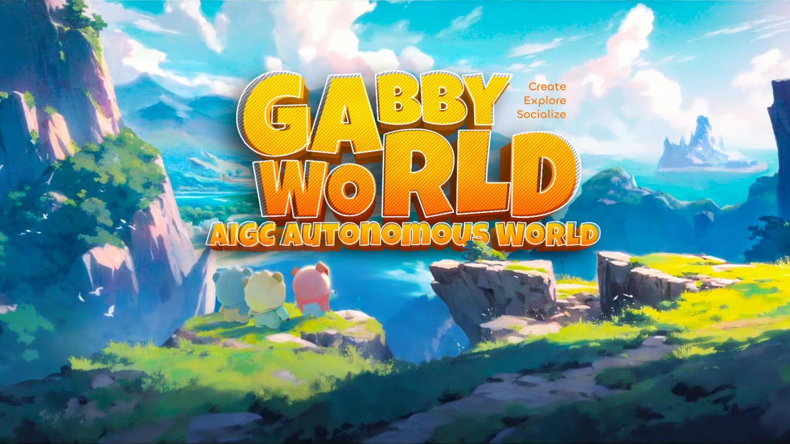

# Gabby World Contract



## About

Gabby World is a fully AIGC autonomous world, where users can raise AI characters, create scenarios/challenges, and explore to collect experiences – all through turning ideas into on-chain prompts.


For more information, visit our official website: [Gabby World](https://www.gabby.world/)


## Run Locally

### Install Dependencies

```bash
$ pnpm install
```

### Compile

Compile the smart contracts with Hardhat

```bash
$ hh compile
```

### Test

Run the tests with Hardhat

```bash
$ hh test
```


## Notes

We are still in our development stage.


## Q&A

Join our discord and feel free to ask there ;)


